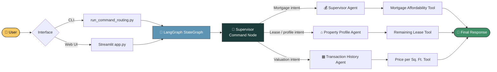
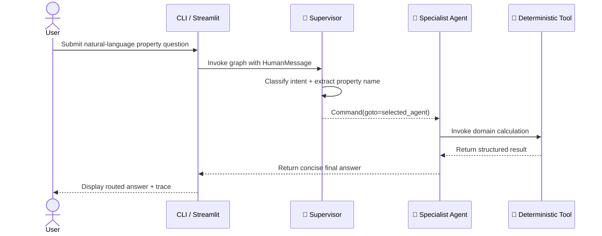
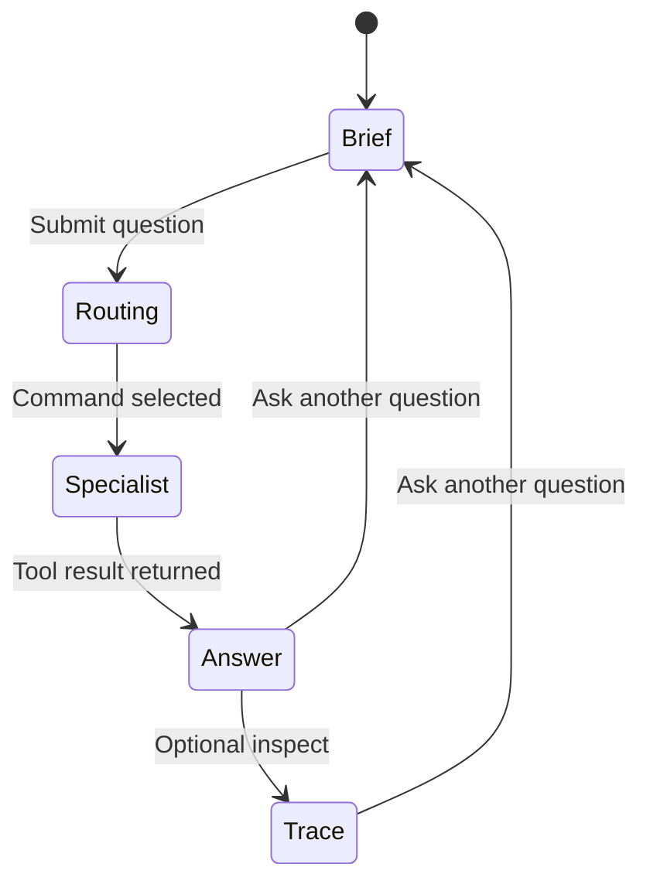

<div align="center">

# 🏠 RealtyFlow

### Multi-Agent Property Intelligence, Powered by LangGraph

<p align="center">
  <strong>Ask naturally. Route intelligently. Calculate precisely.</strong>
</p>

<p align="center">
  A command-routed multi-agent system that understands property questions, extracts real-estate context,<br/>
  selects the right specialist, and returns a precise, deterministic answer — through a polished Streamlit UI or the CLI.
</p>

<p align="center">
  <a href="https://realtyflow---multi-agent-system-using-langgraph-kcs44dzpypzevc.streamlit.app/">
    
  </a>
</p>

<p align="center">
  
  
  
  
</p>

<p align="center">
  
  
  
  
  
</p>

<br/>

<a href="https://realtyflow---multi-agent-system-using-langgraph-kcs44dzpypzevc.streamlit.app/">
  
</a>

</div>

---


## ✨ What Is RealtyFlow?

RealtyFlow is a focused **multi-agent real-estate assistant** built with LangGraph. Instead of routing every question to a single oversized prompt, a **supervisor** interprets user intent and hands off the request to the specialist best equipped to handle it — each backed by a deterministic Python tool, not a hopeful LLM guess.

| Agent | Handles | Deterministic Tool |
| --- | --- | --- |
| 🎯 **Supervisor** | Mortgage affordability & general property questions | `calculate_mortgage_affordability` |
| ⌂ **Property Profile Agent** | Lease terms, property profiles, remaining lease calculations | `calculate_remaining_lease` |
| ▦ **Transaction History Agent** | Property valuation & price-per-square-foot questions | `calculate_price_per_sqft` |

A question like:

> *"For the property at Sunset Boulevard, which has a 99-year lease starting in January 1995, how many years are remaining on the lease?"*

is interpreted by the supervisor, routed to the **Property Profile Agent**, processed by the lease calculator, and returned as a concise, grounded answer — every number backed by real arithmetic, not LLM improvisation.

> 💡 **Core idea:** Use a supervisor for intent, specialists for domain reasoning, and deterministic tools for calculations.

---

## 🎯 Why This Architecture?

Real-estate questions often *look* similar on the surface while requiring completely different reasoning paths:

- 💰 A mortgage question needs financial inputs
- ▦ A valuation question needs price and area inputs
- ⌂ A lease question needs precise date arithmetic

Routing everything through one generalist agent makes the system harder to control, harder to debug, and easier to confuse. RealtyFlow instead separates concerns cleanly:

1. 🧭 The **supervisor** identifies what the user is asking
2. 🏷️ It extracts a property name or address when available
3. 🔀 A `Command` dynamically selects the next specialist node
4. 📨 The specialist receives the original conversation plus property context
5. 🧮 A deterministic Python tool performs the calculation
6. ✅ The final specialist response is returned to the CLI or Streamlit UI

This design leaves a clean seam for future specialists — a rental-yield agent, tax-estimate agent, comparable-sales agent, or document-analysis agent can all be dropped in without touching existing routing logic.

---

## 🏗️ Architecture Overview



### 🔁 Command routing at a glance



### 🗂️ State transitions (frontend)



---

## 🌐 Live Demo

RealtyFlow is deployed and ready to try — no setup required.

<div align="center">

### 👉 [**realtyflow---multi-agent-system-using-langgraph-kcs44dzpypzevc.streamlit.app**](https://realtyflow---multi-agent-system-using-langgraph-kcs44dzpypzevc.streamlit.app/)

</div>

Try questions like:

```text
For the property at Sunset Boulevard, which has a 99-year lease starting in January 1995,
how many years are remaining on the lease?
```

```text
A property costs 950000 and has 1250 square feet. What is the price per square foot?
```

```text
If monthly income is 8000 and the interest rate is 5.5%, what mortgage can be afforded over 30 years?
```

---

## 🧩 Repository Structure

```
.
├── app.py                     # Animated Streamlit property-intelligence frontend
├── run_command_routing.py     # Main LangGraph command-routing entry point
├── main.py                    # Package placeholder entry point
├── workflow.txt               # Original implementation notes
├── pyproject.toml             # Project metadata and Streamlit dependency
├── README.md                  # Project documentation
└── src/
    ├── __init__.py
    ├── nodes.py                # State schema, agents, routing, and graph nodes
    ├── prompts.py               # Supervisor and specialist prompt contracts
    └── tools.py                  # Deterministic real-estate calculation tools
```

### 📋 Module responsibilities

| File | Responsibility |
| --- | --- |
| `run_command_routing.py` | Builds the `StateGraph`, registers nodes, accepts a CLI query, and invokes the graph |
| `app.py` | Interactive light-themed frontend that displays routed results |
| `src/nodes.py` | Defines `SupervisorState`, agent instances, routing decisions, and specialist nodes |
| `src/prompts.py` | Defines supervisor, property-profile, and transaction-history instructions |
| `src/tools.py` | Implements mortgage, lease, and price-per-square-foot calculations |
| `pyproject.toml` | Project metadata and the Streamlit dependency |
| `workflow.txt` | Original step-by-step development notes |

> ℹ️ `main.py` currently remains a minimal package placeholder. The functional CLI entry point is `run_command_routing.py`.

---

## 🧠 Agent Network

### 1️⃣ Supervisor command node

The routing brain of the system. It receives the user's messages and produces a structured `SupervisorDecision`:

```python
class SupervisorDecision(BaseModel):
    next_agent: Literal[
        "transaction_history_agent",
        "property_profile_agent",
        "none",
    ]
    property_name: str = ""
    response: str = ""
```

The supervisor can:

- 🔀 Route transaction-history and valuation questions
- ⌂ Route property-profile and lease questions
- 💰 Use the mortgage affordability tool directly for mortgage-related questions
- 🏷️ Extract a property name or address into `property_name`
- 💬 Return a direct supervisor response when no specialist route is needed

The routing decision flows through LangGraph's `Command` mechanism rather than a separate conditional-edge function.

### 2️⃣ Property Profile Agent

Handles leasehold and property-detail questions. Its tool, `calculate_remaining_lease`, accepts a lease start year, duration, and start month, then returns the estimated remaining years, lease expiry year, and qualitative status.

### 3️⃣ Transaction History Agent

Handles valuation-style questions. Its tool, `calculate_price_per_sqft`, divides total property price by size and classifies the result into an affordability tier:

| Price per square foot | Tier |
| --- | --- |
| Above `$2,500` | 💎 Premium |
| Above `$1,800` | 🏙️ High-End |
| Above `$1,200` | 🏘️ Mid-Range |
| `$1,200` or below | 🏡 Affordable |

### 4️⃣ Mortgage capability

Owned directly by the supervisor agent via `calculate_mortgage_affordability`. Applies a 30% monthly-income rule and calculates the maximum loan amount using the supplied interest rate and loan term.

---

## 🛠️ Deterministic Tool Contracts

The language model determines **which** tool path to use — Python performs the actual arithmetic. This separation makes numerical behavior easy to inspect, test, and improve.

<details>
<summary><strong>📐 Lease calculation</strong></summary>

```python
calculate_remaining_lease(
    lease_start_year: int,
    lease_duration: int = 99,
    lease_start_month: int = 1,
) -> dict
```

Returns:

```json
{
  "remaining_years": 67.4,
  "status": "Good",
  "lease_start_year": 1995,
  "lease_start_month": 1,
  "lease_duration_years": 99,
  "lease_expiry_year": 2094
}
```

Calculates the lease end date from the start year plus duration and estimates remaining months relative to the current date.

</details>

<details>
<summary><strong>▦ Price-per-square-foot calculation</strong></summary>

```python
calculate_price_per_sqft(
    total_price: float,
    size_sqft: float,
) -> dict
```

Returns:

```json
{
  "price_per_sqft": 1850.0,
  "tier": "High-End"
}
```

</details>

<details>
<summary><strong>💰 Mortgage affordability calculation</strong></summary>

```python
calculate_mortgage_affordability(
    monthly_income: float,
    interest_rate: float,
    loan_years: int = 30,
) -> dict
```

Returns:

```json
{
  "max_loan_amount": 246743.19,
  "max_monthly_payment": 2400.0,
  "loan_term_years": 30
}
```

</details>

### ✅ Validation behavior

The tools reject invalid values rather than returning misleading calculations:

- Monthly income must be greater than zero
- Interest rate cannot be negative
- Loan duration must be greater than zero
- Total property price must be greater than zero
- Property size must be greater than zero
- Lease start year must be valid
- Lease duration must be greater than zero
- Lease start month must be between `1` and `12`

---

## 🖥️ Streamlit Frontend

`app.py` provides a polished, animated interface for the same command-routing graph used by the CLI.

| Experience | Description |
| --- | --- |
| 💬 **Natural-language composer** | Ask a property question without formatting a command manually |
| 🧭 **Agent network sidebar** | See the supervisor, property-profile, transaction-history, and mortgage capabilities |
| ⚡ **Example prompts** | Discover supported question types quickly |
| 🏷️ **Route badge** | See which specialist handled the request |
| ⌂ **Property chip** | See the property name extracted by the supervisor |
| 📝 **Answer card** | Read the final response in a focused editorial layout |
| 🔍 **Agent trace** | Expand the full message sequence for debugging and transparency |
| ✨ **Animated visual system** | Light sage theme, gradient hero, hover cards, shimmer buttons, focus states, motion preferences |

All custom HTML and CSS for the visual layer live inside `app.py` — no separate frontend asset directory required.

**👉 [Try it live now](https://realtyflow---multi-agent-system-using-langgraph-kcs44dzpypzevc.streamlit.app/)**

---

## 🚀 Quickstart

### 1. Clone the repository

```bash
git clone https://github.com/paras160500/RealtyFlow---Multi-Agent-System-using-Langgraph.git
cd RealtyFlow---Multi-Agent-System-using-Langgraph
```

### 2. Create a virtual environment

The repository metadata targets Python **3.13 or newer**:

```bash
python -m venv .venv
source .venv/bin/activate
```

On Windows PowerShell:

```powershell
python -m venv .venv
.venv\Scripts\Activate.ps1
```

### 3. Install dependencies

```bash
python -m pip install --upgrade pip
pip install -e .
pip install langgraph langchain langchain-openai python-dotenv pydantic typing-extensions
```

> If your environment already installs these packages through a project manager such as `uv`, use the equivalent environment-specific command.

### 4. Configure OpenAI

The current implementation initializes `gpt-4o-mini` with temperature `0.0`, so provide an OpenAI key in the environment:

```bash
# macOS / Linux
export OPENAI_API_KEY="sk-your-key-here"

# Windows PowerShell
$env:OPENAI_API_KEY="sk-your-key-here"
```

Or create a `.env` file in the project root:

```
OPENAI_API_KEY=sk-your-key-here
```

The code loads environment variables with `python-dotenv`.

### 5. Start the Streamlit interface

```bash
streamlit run app.py
```

Available locally at:

```
http://localhost:8501
```

Or skip the setup entirely and use the **[hosted live app](https://realtyflow---multi-agent-system-using-langgraph-kcs44dzpypzevc.streamlit.app/)**.

---

## 💬 Using the CLI

The original command-routing workflow remains available exactly as a command-line program:

```bash
python run_command_routing.py "For the property at Sunset Boulevard, which has a 99-year lease starting in January 1995, how many years are remaining on the lease?"
```

A shorter default invocation is also supported:

```bash
python run_command_routing.py
```

The script prints the query, invokes the graph, and reports the extracted `property_name` from the final state.

### Programmatic usage

```python
from langchain_core.messages import HumanMessage
from run_command_routing import build_graph


graph = build_graph()

final_state = graph.invoke(
    {
        "messages": [
            HumanMessage(
                content=(
                    "For the property at Sunset Boulevard, which has a "
                    "99-year lease starting in January 1995, how many years "
                    "are remaining on the lease?"
                )
            )
        ]
    }
)

print(final_state)
```

---

## 🔐 Configuration Reference

| Variable | Required | Current usage |
| --- | --- | --- |
| `OPENAI_API_KEY` | ✅ Yes | Authenticates the LangChain chat models |
| `OPENAI_BASE_URL` | ⬜ Optional | Route through an OpenAI-compatible endpoint supported by your environment |
| `LANGCHAIN_TRACING_V2` | ⬜ Optional | Enables LangSmith tracing when configured |
| `LANGCHAIN_API_KEY` | ⬜ Optional | Used for LangSmith observability when tracing is enabled |

The current repository does not require Tavily, Bluesky, or database credentials — its domain tools are local, deterministic Python functions.

> 🔒 **Security:** Never commit `.env`, API keys, provider tokens, or local secrets. Use an app-specific credential where the provider supports it.

---

## 🔍 Example Questions

<table>
<tr><th>⌂ Lease & Property Profile</th></tr>
<tr><td>

```text
For the property at Sunset Boulevard, which has a 99-year lease starting in
January 1995, how many years are remaining on the lease?
```

```text
Tell me about the property profile for Sunset Boulevard.
```

</td></tr>
<tr><th>▦ Valuation & Transaction History</th></tr>
<tr><td>

```text
A property costs 950000 and has 1250 square feet. What is the price per square foot?
```

</td></tr>
<tr><th>💰 Mortgage Affordability</th></tr>
<tr><td>

```text
If monthly income is 8000 and the interest rate is 5.5%, what mortgage can be afforded over 30 years?
```

</td></tr>
</table>

The prompt contracts instruct agents to remain concise, professional, and grounded in the information available from the question and deterministic tools.

---

## 🧱 How Command Routing Works

The graph is intentionally small and explicit:

```python
def build_graph() -> StateGraph:
    graph = StateGraph(SupervisorState)

    graph.add_node("supervisor", supervisor_command_node)
    graph.add_node("transaction_history_agent", transaction_history_agent_node)
    graph.add_node("property_profile_agent", property_profile_agent_node)

    graph.add_edge(START, "supervisor")

    return graph.compile()
```

The supervisor node returns a `Command` that determines the next destination:

```python
return Command(
    goto=decision.next_agent,
    update=update,
)
```

When the supervisor determines that no specialist route is needed, it returns a command targeting the graph end. Specialist nodes also return commands that terminate after producing their responses.

> 🏛️ **This is the project's defining architectural choice:** the supervisor chooses the route at runtime instead of relying on a fixed conditional-edge tree.

---

## 📦 State Contract

The current supervisor state is deliberately compact:

```python
class SupervisorState(TypedDict, total=False):
    messages: Annotated[list, add_messages]
    next: str | None
    property_name: str
```

| Field | Purpose |
| --- | --- |
| `messages` | Conversation history shared between supervisor and specialists |
| `next` | Optional future routing metadata |
| `property_name` | Address or property name extracted by the supervisor |

The `messages` field uses LangGraph's `add_messages` reducer so new messages are appended to the conversation state.

---

## 🧪 Development and Verification

### Syntax checks

```bash
python -m py_compile app.py run_command_routing.py
python -m py_compile src/*.py
```

### Import check

```bash
python -c "from run_command_routing import build_graph; print('Graph import: OK')"
```

### Streamlit startup check

```bash
streamlit run app.py
```

Confirm the page loads with:

- ✅ The RealtyFlow hero section
- ✅ The agent network sidebar
- ✅ The property-question input
- ✅ Example question cards
- ✅ Analyze and Clear controls
- ✅ Bottom metrics

### Behavioral test matrix

| Test case | Expected behavior |
| --- | --- |
| Lease question | Routes to `property_profile_agent` |
| Price-per-square-foot question | Routes to `transaction_history_agent` |
| Mortgage question | Uses the supervisor's mortgage tool |
| Property address in query | Extracts and displays `property_name` when recognized |
| General unsupported question | Supervisor returns a direct response or a clear explanation |
| Missing `OPENAI_API_KEY` | The app fails with a visible configuration error rather than a silent blank screen |
| Invalid numeric tool input | The relevant tool raises a validation error |
| Agent trace expansion | Displays the messages returned by the graph for debugging |

---

## 🛡️ Reliability and Safety Notes

RealtyFlow should be treated as an intelligent assistant, **not** an autonomous source of legal, financial, or property advice. The deterministic tools improve arithmetic reliability, but the system can still misunderstand user intent or receive incomplete information.

Before using an answer for a real transaction:

1. ✅ Verify the property details and dates
2. ✅ Confirm the input assumptions used by the tool
3. ✅ Review the extracted property name
4. ✅ Recalculate important financial figures independently
5. ✅ Consult a qualified professional for legal, mortgage, valuation, or lease decisions

For production use, consider adding structured output validation, source/document ingestion, evaluation datasets, retries, rate-limit handling, request IDs, logging, tracing, and explicit confidence or assumption displays.

---

## 🗺️ Roadmap

| Status | Capability | Description |
| --- | --- | --- |
| ✅ | Command-based supervisor | Dynamically routes questions with LangGraph `Command` |
| ✅ | Property-profile specialist | Supports lease and property-detail reasoning |
| ✅ | Transaction-history specialist | Calculates price per square foot and valuation tier |
| ✅ | Mortgage affordability tool | Applies income, rate, and loan-term inputs |
| ✅ | Streamlit frontend | Polished, interactive, and **live** property-intelligence experience |
| 🔜 | Structured extraction | Parse numerical inputs before agent invocation |
| 🔜 | Comparable-sales agent | Analyze comparable property records |
| 🔜 | Document ingestion | Read lease agreements and property PDFs |
| 🔜 | Confidence and assumptions | Show exactly what inputs drove a result |
| 🔜 | Test suite | Add unit, routing, integration, and evaluation tests |
| 🔜 | Observability | Add LangSmith traces, structured logs, and latency metrics |
| 🔜 | Persistent conversations | Store user sessions and property research history |
| 🔜 | Multi-model routing | Select models based on cost, speed, and task complexity |

---

## 🤝 Contributing

Contributions are welcome! Keep changes focused and preserve the separation between routing, specialist behavior, deterministic tools, and presentation layers.

**Recommended workflow:**

```bash
git checkout -b feature/your-improvement
# implement the change
python -m py_compile app.py run_command_routing.py
python -m py_compile src/*.py
git add .
git commit -m "feat: describe your improvement"
git push origin feature/your-improvement
```

When opening a pull request, include:

- 🧩 The problem being solved
- 🤖 The agent or tool affected
- 🔐 Any new environment variables
- 💬 Example questions that demonstrate the change
- 🧪 Test commands and results
- 📸 Screenshots when modifying the Streamlit interface

### 🧬 Adding a new specialist

1. Define a deterministic tool in `src/tools.py`
2. Add a prompt contract in `src/prompts.py`
3. Create an agent with the appropriate tool
4. Extend `SupervisorDecision.next_agent` with the new route
5. Update `SUPERVISOR_PROMPT` with routing instructions
6. Add a node function in `src/nodes.py`
7. Register the node in `build_graph()`
8. Add examples and tests
9. Update the Streamlit sidebar and README documentation

---

## 📜 License and Project Status

This repository is an early-stage project and does not currently include an explicit license file. Add a license before distributing or reusing the project as a public package.

The current package metadata identifies the project as version `0.1.0`, targeting Python `3.13+`.

---

## 🙌 Built With

<p align="center">
  
  
  
  
  
  
</p>

- **LangGraph** — stateful graph orchestration and command-based routing
- **LangChain** — agent construction and model integration
- **GPT-4o-mini** — supervisor and specialist reasoning
- **Pydantic** — structured routing decisions
- **Streamlit** — the interactive property-intelligence frontend
- **Python** — deterministic and inspectable real-estate calculations

---

<div align="center">

### ⌂ Ask better property questions.
### Route the reasoning. Trust the calculation.

**[🚀 Launch the Live App](https://realtyflow---multi-agent-system-using-langgraph-kcs44dzpypzevc.streamlit.app/)**

If RealtyFlow helps you explore multi-agent systems, consider ⭐ starring the repository and sharing what you build with it.

</div>

---

## 📚 References

- [LangGraph Documentation](https://langchain-ai.github.io/langgraph/)
- [LangChain Documentation](https://python.langchain.com/)
- [Streamlit Documentation](https://docs.streamlit.io/)
- [OpenAI Platform Documentation](https://platform.openai.com/docs/)
- [Pydantic Documentation](https://docs.pydantic.dev/)